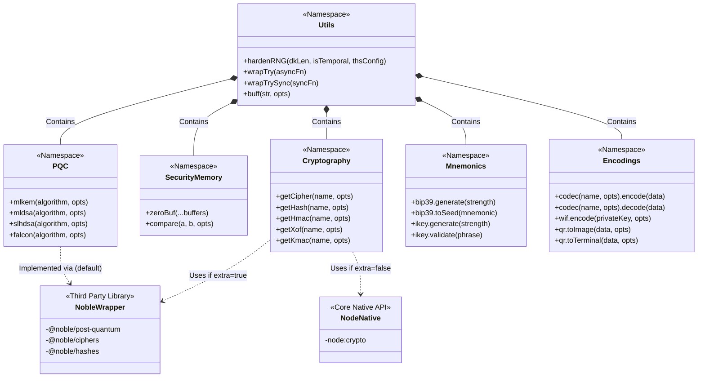

<br />

# @stless/utils

[](https://www.npmjs.com/package/@stless/utils)

[](https://github.com/harnuma9/stless-utils/blob/main/LICENSE)

[](https://badge.socket.dev/npm/package/@stless/utils/1.1.3)
[](https://harnuma9.github.io/donate/)

<br />

**High-performance, auditable, memory-safe cryptographic and encoding utilities** with first-class **post-quantum** support.

Built for modern security-critical applications: wallets, key management, secure messaging, and frameworks that need battle-tested primitives without bloat.

<br />

> **Full API context optimized for AI assistants and contributors** is available in [`llms-full.txt`](https://github.com/harnuma9/stless-utils/blob/main/llms-full.txt).

<br />
<br />

## ✨ Features

- **[Post-Quantum Cryptography](https://csrc.nist.gov/projects/post-quantum-cryptography)** (FIPS 203/204/205 + NIST Round 3)
  - **[ML-KEM](https://csrc.nist.gov/pubs/fips/203/ipd)** (Kyber), **[ML-DSA](https://csrc.nist.gov/pubs/fips/204/ipd)** (Dilithium), **[SLH-DSA](https://csrc.nist.gov/pubs/fips/205/ipd)** (SPHINCS+), **[Falcon](https://falcon-sign.info/)**
- **Modern Symmetric Crypto** (**[AES-GCM](https://nvlpubs.nist.gov/nistpubs/Legacy/SP/nistspecialpublication800-38d.pdf)**, **[XChaCha20-Poly1305](https://datatracker.ietf.org/doc/html/rfc8439)**, etc.)
- **Memory Safety** — **[constant-time comparison](https://www.chosenplaintext.ca/articles/beginners-guide-constant-time-cryptography.html)**, **[secure zeroing](https://owasp.org/www-community/vulnerabilities/Memory_leak)**, temporal hardening
- **Two Mnemonic Systems**
  - Standard **[BIP39](https://github.com/bitcoin/bips/blob/master/bip-0039.mediawiki)** (multi-language)
  - **iKey** — high-density 65,536-word mnemonic (16 bits per word)
- **KDF**: **[Argon2id](https://www.rfc-editor.org/rfc/rfc9106.html)** (native Node.js)
- **Encoding**: **[base16/32/58/64](https://datatracker.ietf.org/doc/html/rfc4648)**, **[bech32(m)](https://github.com/bitcoin/bips/blob/master/bip-0350.mediawiki)**, **[WIF](https://en.bitcoin.it/wiki/Wallet_import_format)**, QR codes (GIF/SVG/Terminal)
- **Extra**: Leverages **[@noble/*](https://github.com/paulmillr/noble-hashes)** for browser compatibility
- **Auditable** — tiny surface, **[strict mode](https://developer.mozilla.org/en-US/docs/Web/JavaScript/Reference/Strict_mode)**, checksum verification on build

<br />

---

<br />

## 📦 Installation

```bash
npm install @stless/utils
# or
yarn add @stless/utils
```

**Requires Node.js ≥ 24**

<br />
<br />

## 🚀 Quick Start

```javascript
// ESM
import Utils from '@stless/utils';
// or CJS
const { Utils } = require('@stless/utils');

// Secure random bytes (with optional temporal hardening)
const key = await Utils.hardenRNG(32, true);

// Argon2id KDF
const hash = await Utils.argon2('argon2id', {
  msg: 'my password',
  salt: await Utils.hardenRNG(16)
});

// Post-Quantum Key Encapsulation
const { publicKey, secretKey } = Utils.mlkem('ml-kem-768', {
  seed: await Utils.hardenRNG(64)
});

// Post-Quantum Key Signature
const { publicKey, secretKey } = Utils.mldsa('ml-dsa-65', {
  seed: await Utils.hardenRNG(32)
});
```

<br />

## 📘 API Documentation

### Core Utilities

```javascript
// Buffer handling & memory safety
const buf = Utils.buff('hello', { encoding: 'utf-8' });
Utils.zeroBuf(buf);                    // secure wipe
Utils.compare(a, b, { harden: true }); // constant-time

// Clones an allocated space with optional memory-purging of original source
const clone = Utils.copyBuf(buf, buf.length, true); // true = zero-wipes 'buf' instantly

// Evaluates general truthiness or checks length limits >= 1
const hasContent = Utils.bool(input, true); 

// Randomness
const entropy = await Utils.hardenRNG(32, isHardenRNG, conf);

// Try/catch sugar
const result = await Utils.wrapTry(async () => { ... });
```

### Type Primitives & Extended Codecs

```javascript
// Strict Primitive Assertions (Null-Safe)
Utils.isString('Hello World');      // true
Utils.isNumber(2026);         // true
Utils.isBoolean(false);       // true
Utils.isObject({ foo: 'bar' }); // true (returns false for null inputs)
Utils.isUndefined(undefined); // true
Utils.isFunction(() => {});   // true
Utils.isSymbol(Symbol('id')); // true
Utils.isBigInt(100n);         // true

// Inline Short-Form Codec Processing
const hexString = Utils.toBase16(rawData);
const decodedBuffer = Utils.fromBase16(hexString);

// All base codecs accept an optional 'clear' flag to zero-wipe source bytes after processing
const b64UrlEncoded = Utils.toBase64Url(sensitiveBuffer, true); // clear=true
```

### Encoding & Formats

```javascript
// Base codecs
const b58 = Utils.codec('base58').encode(data);
const decoded = Utils.codec('base58').decode(b58);

Utils.codec('bech32').encode(...);
Utils.codec('base64url').encode(...);

// Wallet Import Format
const wif = Utils.wif.encode(privateKey, { compressed: true });
const { privateKey: pk } = Utils.wif.decode(wif);
```

### QR Codes

```javascript
// GIF (native, no canvas)
const gif = Utils.qr.toImage('https://example.com', { scale: 6 });

// SVG
const svg = Utils.qr.toSVG(data);

// Terminal
console.log(Utils.qr.toTerminal(data));
```

### Cryptography

```javascript
const key = await Utils.hardenRNG(32);
const msg = Utils.buff('top secret');

// 1. Unified Noble Access (extra: true)
// Works for AES-GCM, XChaCha20, XSalsa20, etc.
const iv = await Utils.hardenRNG(24); // 24 bytes for X-variants
const cipher = Utils.getCipher('xchacha20-poly1305', {
    key, iv, extra: true, e: true, buffer: true
});

const encrypted = Buffer.concat([cipher.update(msg), cipher.final()]);

// 2. Node.js Native Access (extra: false)
const iv2 = await Utils.hardenRNG(16);
const cipher2 = Utils.getCipher('aes-256-ctr', {
    key, iv: iv2, e: true
});

const encrypted2 = Buffer.concat([cipher2.update(msg), cipher2.final()]);
```

### Hashes & MACs

```javascript
const hash = Utils.getHash('sha3-512', { extra: true })
  .update(data)
  .digest();

const hmac = Utils.getHmac('sha256', { key });
```

### XOF & KMAC

```javascript
const xof = Utils.getXof('shake256', { extra: true, o: { dkLen: 64 } });
const kmac = Utils.getKmac('kmac256', { key });
```

<br />

## Post-Quantum Cryptography

```javascript
// ML-KEM (Key Encapsulation)
const kem = Utils.mlkem('ml-kem-1024', { seed });

// ML-DSA (Signatures)
const dsa = Utils.mldsa('ml-dsa-87', { seed });

// SLH-DSA
const sphincs = Utils.slhdsa('slh-dsa-sha2-256f', { seed });

// Falcon
const falcon = Utils.falcon('falcon1024', {
    seed
    clear: true,  // Clear the input seed
});
```

All PQC functions are **deterministic** when given the same seed.
See **[@noble/post-quantum](https://npmjs.com/package/@noble/post-quantum)** for full documentations and usage.

<br />

## Mnemonics

### BIP39 (Standard)

```javascript
const mnemonic = Utils.bip39.generate(256, { lang: 'english' });
const seed = Utils.bip39.toSeed(mnemonic, { password: 'optional' });
const valid = Utils.bip39.validate(mnemonic);
```

### iKey (High-Density 65,536-word list)

```javascript
// Generate 256-bit iKey (17 words including checksum)
const ikey = await Utils.ikey.generate(256, { isHardenRNG: true });

// Validate
const isValid = Utils.ikey.validate(ikey);

// Conversion
const bytes = Utils.ikey.toBytes(phrase);
const words = Utils.ikey.toWords(buffer);
```

<br />
<br />

## 🔒 Security Notes

* All **[Noble ciphers](https://npmjs.com/package/@noble/ciphers)** are wrapped to support the standard `.update(data)` and `.final()` pattern, regardless of whether the underlying algorithm is a one-shot function or a stateful class.
* All sensitive buffers are zeroed after use when `clear: true` is passed.
* `compare()` uses `timingSafeEqual` (or hardened double-hash mode).
* `hardenRNG` integrates [ths-csprng wrapper](https://www.npmjs.com/package/ths-csprng) for temporal hardening.
* Checksums are generated and verified on every build [verify.sh](https://github.com/harnuma9/stless-utils/blob/main/verify.sh).
* Prefer `extra: true` for Noble implementations in cross-platform code.

**Always** use the library's memory management helpers when handling secrets.

<br />

---

<br />

## 🔍 Algorithm Discovery

Instead of maintaining static lists, you can query the engine directly for all supported primitives.

```javascript
// Get everything: PQC, Noble (extra), and Native (crypto)
const registry = Utils.names;

console.log(registry.pqc);    // All Noble Post-Quantum algorithms
console.log(registry.extra);  // All Noble (Extra) algorithms
console.log(registry.crypto); // All secure-filtered native algorithms
```

<br />
<br />

## 📃 Supported Algorithm Names

<br />

### Encoding

**`Utils.codec(name)`**

| Category                    | Supported Names |
|-----------------------------|-----------------|
| **Standard Bases**          | `base16`, `base32`, `base58`, `base64` |
| **Flavors**                 | `base58xmr`, `base58xrp`, `base64url`, `base32hex`, `base32crockford`, `base58check` |
| **Bitcoin / Lightning**     | `bech32`, `bech32m` |

<br />

### KDF

**`Utils.argon2(name = 'argon2id')`**

| Variant     | Name |
|-------------|------|
| Default     | `argon2id` |
| Alternatives| `argon2i`, `argon2d` |

<br />

### Post-Quantum Functions

| Function              | Supported Names |
|-----------------------|-----------------|
| `Utils.mlkem()`       | `ml-kem-512`, `ml_kem512`, `ml-kem-768`, `ml_kem768`, `ml-kem-1024`, `ml_kem1024` |
| `Utils.mldsa()`       | `ml-dsa-44`, `ml_dsa44`, `ml-dsa-65`, `ml_dsa65`, `ml-dsa-87`, `ml_dsa87` |
| `Utils.slhdsa()`      | `slh-dsa-sha2-128f`, `slh-dsa-sha2-128s`, `slh-dsa-sha2-192f`, `slh-dsa-sha2-192s`,<br>`slh-dsa-sha2-256f`, `slh-dsa-sha2-256s`,<br>`slh-dsa-shake-128f`, `slh-dsa-shake-128s`, `slh-dsa-shake-192f`, `slh-dsa-shake-192s`,<br>`slh-dsa-shake-256f`, `slh-dsa-shake-256s` |
| `Utils.falcon()`      | `falcon512`, `falcon1024` |

<br />

### Noble Direct Access

**`Utils.noble(name)`**

| Category                    | Names |
|-----------------------------|-------|
| **Ciphers**                 | `aes`, `chacha`, `salsa` |
| **Hashes / HMAC / XOFs**    | `noble_hmac`, `sha2`, `sha3`, `sha3_addons`, `blake3_mod`, `blake2`, `legacy` |
| **PQC: ML-KEM**             | `ml_kem512`, `ml_kem_512`, `ml_kem768`, `ml_kem_768`, `ml_kem1024`, `ml_kem_1024` |
| **PQC: ML-DSA**             | `ml_dsa44`, `ml_dsa_44`, `ml_dsa65`, `ml_dsa_65`, `ml_dsa87`, `ml_dsa_87` |
| **PQC: Signature / Other**  | `slh_dsa`, `falcon512`, `falcon1024` |

<br />

### Node.js Built-in Crypto (`extra: false`)

| Function                | Supported Algorithms |
|-------------------------|----------------------|
| `Utils.getCipher()`     | `aes-256-gcm`, `aes-256-ctr`, `aes-256-cfb`, `aes-256-cfb1`, `aes-256-cfb8`, `aes-256-ocb`, `aes-256-ofb`, `aes-256-xts`, `chacha20-poly1305`, `chacha20` |
| `Utils.getHmac()`       | `sha224`, `sha256`, `sha384`, `sha512`, `sha512-224`, `sha512-256`, `ripemd`, `ripemd160`, `rmd160`, `sha1`, `md5`, `md5-sha1` |
| `Utils.getHash()`       | `sha224`, `sha256`, `sha384`, `sha512`, `sha512-224`, `sha512-256`, `sha3-224`, `sha3-256`, `sha3-384`, `sha3-512`, `blake2b512`, `blake2s256`, `ripemd`, `ripemd160`, `rmd160`, `sha1`, `md5`, `md5-sha1` |
| `Utils.getXof()`        | `shake128`, `shake256` |

<br />

### Noble Implementations (`extra: true`)

**Ciphers**

| Category       | Supported Names |
|----------------|-----------------|
| **AES**        | `aes-256-gcm`, `aes-256-ctr`, `aes-256-cfb`, `aes-256-siv` |
| **ChaCha20**   | `chacha20-poly1305`, `xchacha20-poly1305`, `chacha20`, `xchacha20` |
| **Salsa20**    | `xsalsa20-poly1305`, `salsa20`, `xsalsa20` |

<br />

**HMAC, Hash & XOF**

| Function                | Supported Names |
|-------------------------|-----------------|
| `Utils.getHmac()`       | `sha224`, `sha256`, `sha384`, `sha512`, `sha512-224`, `sha512-256`, `ripemd160`, `sha1`, `md5` |
| `Utils.getHash()`       | `sha224`, `sha256`, `sha384`, `sha512`, `sha512-224`, `sha512-256`,<br>`sha3-224`, `sha3-256`, `sha3-384`, `sha3-512`,<br>`keccak-224`, `keccak-256`, `keccak-384`, `keccak-512`,<br>`blake2s256`, `blake2b512`, `blake3`, `ripemd160`, `sha1`, `md5` |
| `Utils.getXof()`        | `shake128`, `shake256`, `cshake128`, `cshake256`, `turboshake128`, `turboshake256`, `k12`, `kt128`, `kt256` |

<br />

**Keyed XOF**

| Function               | Supported Names |
|------------------------|-----------------|
| `Utils.getKmac()`      | `kmac128`, `kmac256` |

<br />

> [!TIP]
> 
> **Consistency & Compatibility**: Use `extra: true` to prioritize Noble implementations for maximum cross-platform consistency and browser support.
>
> **Flexible Naming**: The library supports both **kebab-case** (`ml-kem-512`) and **snake_case** (`ml_kem_512`) for all algorithms (Noble, PQC, Cipher, Hash, HMAC, and XOF). As long as the name is lowercase and valid, the primitive will be resolved correctly.

<br />

---

<br />

## 🛠 ️Development & Verification

```bash
npm run check        # test + verify checksums
npm run build        # minify + generate docs + checksums
npm test
```

<br />

The project uses:

* `terser` for minification
* SHA-256 checksums for all built files
* Strict mode + comprehensive test suite

<br />

---

<br />

## ⭐ Contributor(s)

<a href="https://github.com/harnuma9/stless-utils/graphs/contributors">
  
</a>

<br />
<br />
<br />

## 📄 License

Licensed under the **Apache License, Version 2.0**; a robust, permissive license that includes an explicit grant of patent rights and provides protection against contributor liability.

Copyright © 2026 Aries Harbinger. See the **[LICENSE](https://github.com/harnuma9/stless-utils/blob/main/LICENSE)** file for full details. 

<br />
<br />

## 🔗 Links

* [Github Repository](https://github.com/harnuma9/stless-utils)
* [npm Package](https://www.npmjs.com/package/@stless/utils)
* Full AI Context **[llms-full.txt](https://github.com/harnuma9/stless-utils/blob/main/llms-full.txt)** (for contributors / LLM assistants)

<br />
<br />

**Made with security, auditability, and developer experience in mind.**

<br />
<br />
<br />
<br />